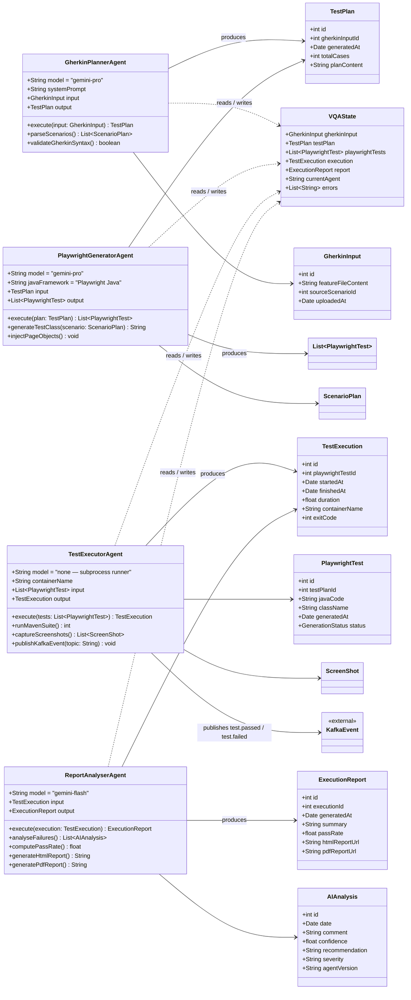

# E2E Test Service UML Diagrams

## 1. Domain model - enriched E2E test pipeline

```mermaid
classDiagram
    direction LR

    class Feature {
        +int id
        +String title
        +FeatureStatus status
        +int totalScenarios
        +int passedScenarios
    }

    class Scenario {
        +int id
        +String name
        +String importance
        +String gherkinText
        +ScenarioStatus status
        +List~String~ tags
        +ValidationAction validationAction
    }

    class Step {
        +int id
        +String name
        +float time
        +StepKeyword keyword
        +StepStatus status
        +String errorMessage
    }

    class TestResult {
        +int id
        +Date date
        +boolean validation
        +String result
        +float time
        +String agentSource
        +String executionId
        +int passedSteps
        +int failedSteps
    }

    class AIAnalysis {
        +int id
        +Date date
        +String comment
        +float confidence
        +String recommendation
        +String severity
        +String agentVersion
    }

    class ScreenShot {
        +int id
        +String url
        +int stepId
        +ScreenshotType type
        +boolean isFailed
    }

    class ScreenshotType {
        <<enumeration>>
        BEFORE
        AFTER
        DIFF
    }

    class GenerationStatus {
        <<enumeration>>
        PENDING
        GENERATED
        FAILED
    }

    class ScreenShot {
        +int id
        +String url
        +int stepId
        +ScreenshotType type
        +boolean isFailed
    }

    class GherkinInput {
        +int id
        +String featureFileContent
        +int sourceScenarioId
        +Date uploadedAt
    }

    class TestPlan {
        +int id
        +int gherkinInputId
        +Date generatedAt
        +int totalCases
        +String planContent
    }

    class PlaywrightTest {
        +int id
        +int testPlanId
        +String javaCode
        +String className
        +Date generatedAt
        +GenerationStatus status
    }

    class TestExecution {
        +int id
        +int playwrightTestId
        +Date startedAt
        +Date finishedAt
        +float duration
        +String containerName
        +int exitCode
    }

    class ExecutionReport {
        +int id
        +int executionId
        +Date generatedAt
        +String summary
        +float passRate
        +String htmlReportUrl
        +String pdfReportUrl
    }

    class FeatureStatus {
        <<enumeration>>
        PENDING
        RUNNING
        PASSED
        FAILED
    }

    class ScenarioStatus {
        <<enumeration>>
        PENDING
        RUNNING
        PASSED
        FAILED
        IGNORED
        REFUSED
    }

    class ValidationAction {
        <<enumeration>>
        VALIDATED
        IGNORED_NOT_IMPORTANT
        IGNORED_INVALID
        REFUSED
    }

    class StepKeyword {
        <<enumeration>>
        GIVEN
        WHEN
        THEN
        AND
        BUT
    }

    class StepStatus {
        <<enumeration>>
        PENDING
        PASSED
        FAILED
        SKIPPED
    }

    class ScreenshotType {
        <<enumeration>>
        BEFORE
        AFTER
        DIFF
    }

    class GenerationStatus {
        <<enumeration>>
        PENDING
        GENERATED
        FAILED
    }

    Feature "1" --> "1..*" Scenario
    Scenario "1" --> "1..*" Step
    Step "1" --> "0..1" ScreenShot
    Scenario "1" --> "1..*" TestResult
    Scenario "1" --> "1..*" AIAnalysis
    TestResult "1" --> "1" AIAnalysis
    GherkinInput "1" --> "1" Scenario : source
    GherkinInput "1" --> "1" TestPlan : produced by Agent 1
    TestPlan "1" --> "1..*" PlaywrightTest : produced by Agent 2
    PlaywrightTest "1" --> "1" TestExecution : produced by Agent 3
    TestExecution "1" --> "1" ExecutionReport : produced by Agent 4
    TestExecution "1" --> "1..*" ScreenShot
    ExecutionReport "1" --> "1..*" AIAnalysis

    Feature --> FeatureStatus
    Scenario --> ScenarioStatus
    Scenario --> ValidationAction
    Step --> StepKeyword
    Step --> StepStatus
    ScreenShot --> ScreenshotType
    PlaywrightTest --> GenerationStatus
```

## 2. LangGraph pipeline - 4 agents

### Notes
- The second diagram includes `ScenarioPlan` because it is an exchanged intermediate object in the agent pipeline.
- The `KafkaEvent` node is shown as an external integration point for the executor agent.
